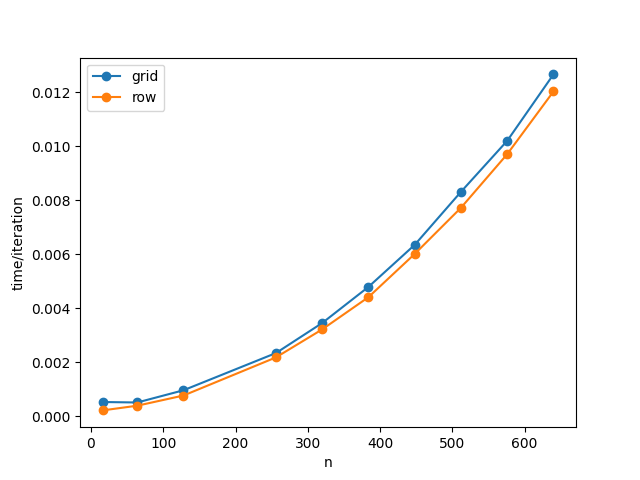
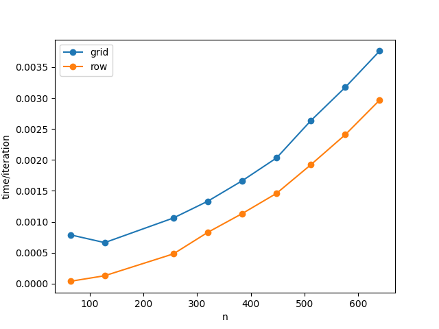
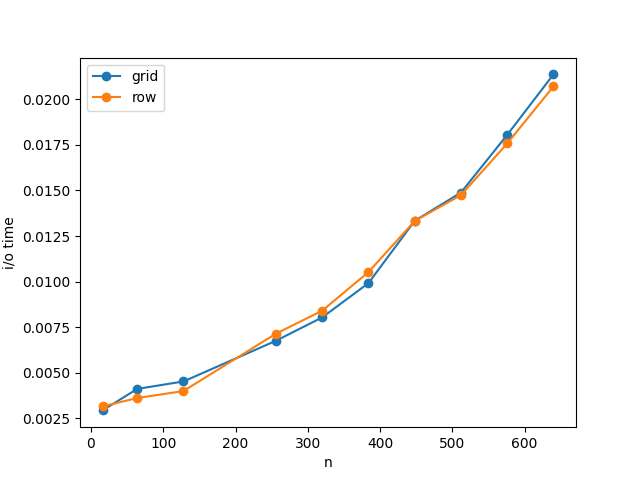
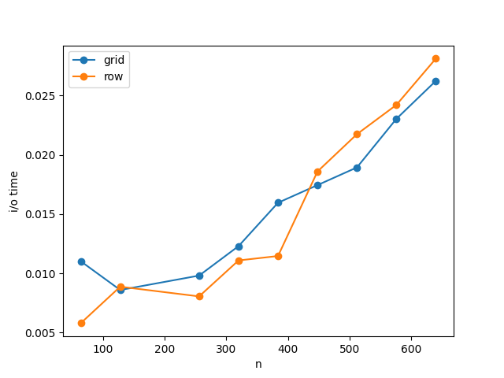

Background
==========

Cellular automata are a computational model which can been used to model
complex systems. They can be applied in areas like biological modeling,
solving partial differential equations, and much more. As such,
determining how to best execute the automata on large scale distributed
systems is a matter of increasing importance in the present day.
Optimizing algorithmic implementations will help increase performance,
as well as help overcome memory limitations for any initial conditions
of the automata.

More specifically, we seek to optimize parallel execution of automata
that use the Moore neighborhood for implementation, where rules are
based on all directly adjacent cells, including diagonally. We will
compare two different programs for this, one which uses a row-wise
partitioning scheme and another which uses grid wise [@cellauto] (shown
below in Figure [\[fig:parts\]](#fig:parts){reference-type="ref"
reference="fig:parts"}). We hope to see which of these approaches
results in the most efficient communication between processes. We also
hope to time view-based I/O [@io] algorithms for each of these, and see
what fraction of the runtime is affected by I/O.

{#fig:sub1}

{#fig:sub2}

Each of these methods have the same communication requirements. That is,
each must send the outermost edges of their partitions to each of their
neighbors, and likewise receive them, in order to have enough
information to update their own cells on the outermost edges. The only
difference lies in which portion of the cell grid each process has.

Predictions
===========

To determine the point at which one of these schemes beats the other, we
may use the postal model. For the row-wise partition, we have that each
process must send 2 message, one for the top row and one for the bottom
row. Each of these rows have a total of $n$ cells, so the time required
for communication must be:

$$T = 2 \alpha + (2n)\beta$$

On the other hand, the grid-wise partitioning sends a total of 8
messages (4 for the sides, 4 for the corners), and the length of each
side is $n\sqrt{p}$. So we have:

$$T = 8\alpha + \left(4 + 4\frac{n}{\sqrt{p}}\right)\beta$$

Given that $\alpha$ is usually much larger than $\beta$, for small input
sizes the first approach will be faster than the second. However, as we
increase the input size, it will be outperformed for larger values of
$p$.

Implementation
==============

We used point-to-point communication to implement both of the
algorithms. [@repo] Communication for the row-wise algorithm is as
follows:

send top row of state to up send bottom row of state to down receive
from down into up\_buf receive from up into down\_buf receive from down
into up\_buf receive from up into down\_buf send top row of state to up
send bottom row of state to down

(The update state function uses the state and the buffers to get the
neighbors of each cell, then looks in the rule table for the expected
new state)

As for I/O, each version was implemented using a higher level view-based
algorithm in order to read in the initial conditions of the automaton
(that is, an $n \times n$ matrix of integers, where the element at row
$i$ and column $j$ is the initial state of the corresponding cell.

create MPI datatype $t$ describing sub-portion of file open file set
file view to $t$ perform collective read or write

The only change in the algorithm between the two partition versions lies
in the datatype. For row-wise, we use `MPI_Type_Contiguous`, and for
grid wise we instead use `MPI_Type_create_subarray` to create an
$n \times n$ subset of the original matrix.

For the grid wise version of the program, the communication works as
such:

make MPI\_Isend request for top row make MPI\_Isend request for upper
right corner $\vdots$ make MPI\_Isend request for upper left corner
receive top row $\vdots$ receive upper left corner

The requests are done using datatypes to avoid the extra computation
cost of copying the columns into the buffers before sending.

Results
=======

To test our hypothesis, we ran our implementation on wheeler, and tested
it over several multiples of 64 for the input sizes, one time using 16
processe and another using 64. We timed both communication and execution
for 100 iterations of Conway's Game of Life [@life] over randomly
generated initial states, and divided by 100 to get an approximation of
time per iteration. Below in figure
[\[fig:comcosts\]](#fig:comcosts){reference-type="ref"
reference="fig:comcosts"} are the results for both numbers of processes.

{#fig:sub1}

{#fig:sub2}

Our results actually ended up being contrary to what we theorized
before. As can be seen, the row version is faster than the grid version,
as if by a constant addition. There are a number of different possible
reasons for this, all based on things that were not accounted for in the
model. For one, the additional time for queue searching for each of the
`MPI_Recv` calls was not included, as there are more receives in the
grid version. It is also possible that the row version is more topology
respecting than the grid version. Lastly, there is an additional
computation cost in the grid version from having to check more
conditions when deciding which array to retrieve the cell from, whereas
for the other version we just decide between the main grid, the top
buffer, and the bottom buffer.

There were also timings made for reading in the initial state for both
of these program counts, shown in figure
[\[fig:iocosts\]](#fig:iocosts){reference-type="ref"
reference="fig:iocosts"}. It seems that, for lower process counts,t he
I/O performance of both versions is roughly the same. When there are
more processes, however, the grid-based version out-performs the other.

{#fig:sub1}

{#fig:sub2}

Conclusion + Future Work
========================

Overall, we did not see the results we were looking for, namely that the
grid partitioning is more efficient than the row partitioning. Instead
we got the complete opposite. This could perhaps tell us that, for input
matrix sizes that aren't extremely large, the benefit of the grid
partitioning isn't obvious, mostly because the input matrix size scales
quadratically as $n$ increases while the communication requirements only
scale linearly. There are still many possible optimizations that could
be made in the future to make the one method approach the other more
quickly.

In the future, one possible optimization that could be made is to
instead store the intial state of the automaton as a sparse array of
integers, at least for cases where most of the cells are the same (as
was the case in most initial configurations for Conway's GOL). It would
also be beneficial to look into possible optimizations using one-sided
communication, and perhaps to further parallelize the execution using
MPI + OpenMP.

9 A. Giordano, A. De Rango, D. D'Ambrosio, R. Rongo and W. Spataro,
\"Strategies for Parallel Execution of Cellular Automata in Distributed
Memory Architectures,\" 2019 27th Euromicro International Conference on
Parallel, Distributed and Network-Based Processing (PDP), 2019, pp.
406-413, doi: 10.1109/EMPDP.2019.8671639. 

Blas, Javier Garc, et al.
"View-Based Collective I/O for MPI-IO." 2008 Eighth IEEE International
Symposium on Cluster Computing and the Grid (CCGRID), 2008,
https://doi.org/10.1109/ccgrid.2008.85. 

"Conway's Game of Life."
Wikipedia, Wikimedia Foundation, 28 Nov. 2022,
https://en.wikipedia.org/wiki/Conway%27s\_Game\_of\_Life
\#/media/File:Game\_of\_life\_loaf.svg 

Gardner, Martin. " The Fantastic
Combinations of John Conway's New Solitaire Game 'Life.'" Scientific
American, Oct. 1970, pp. 120--123.
https://github.com/christopherjmedlin/cs442-final-project
